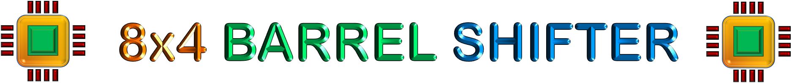
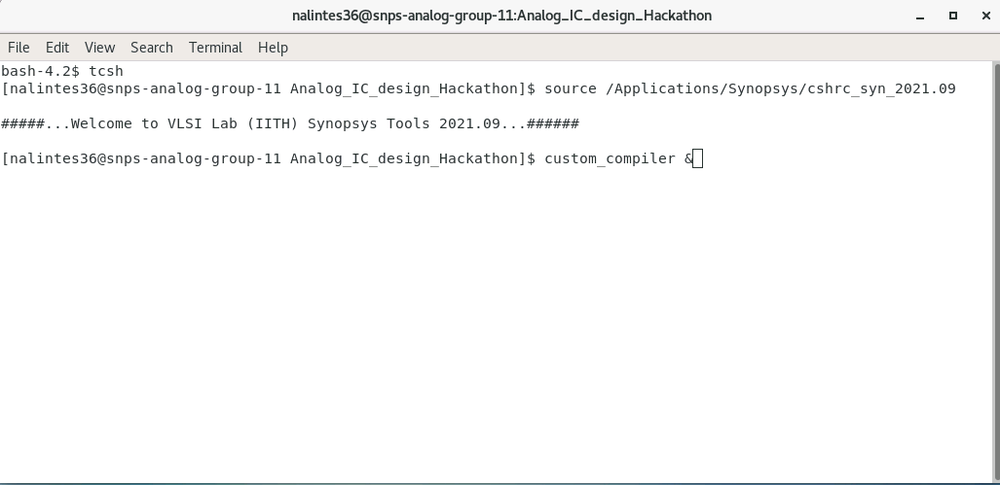
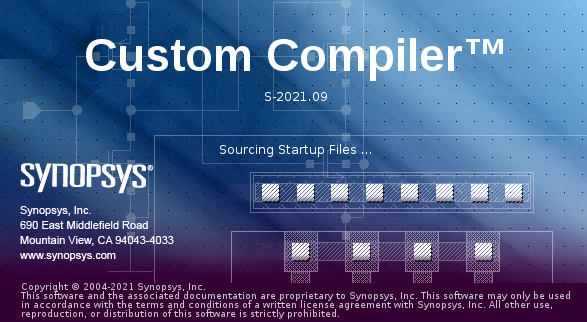
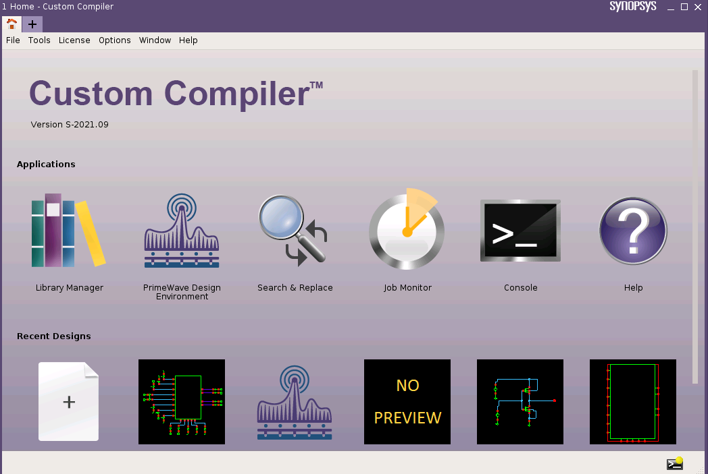
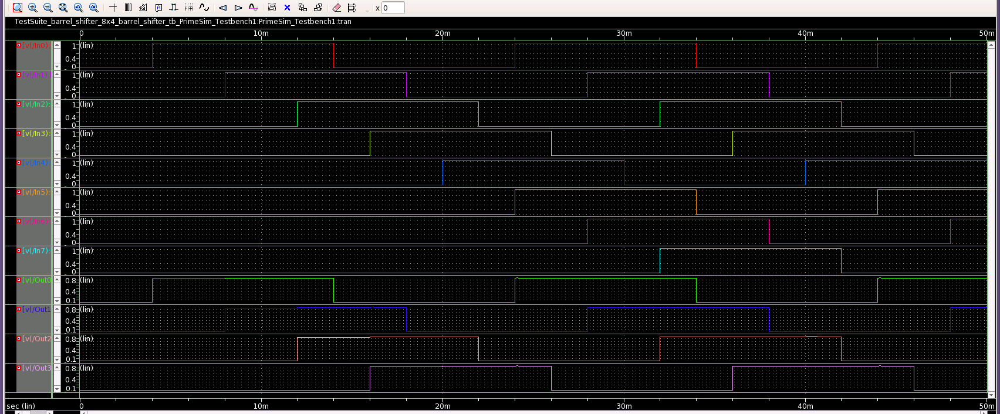
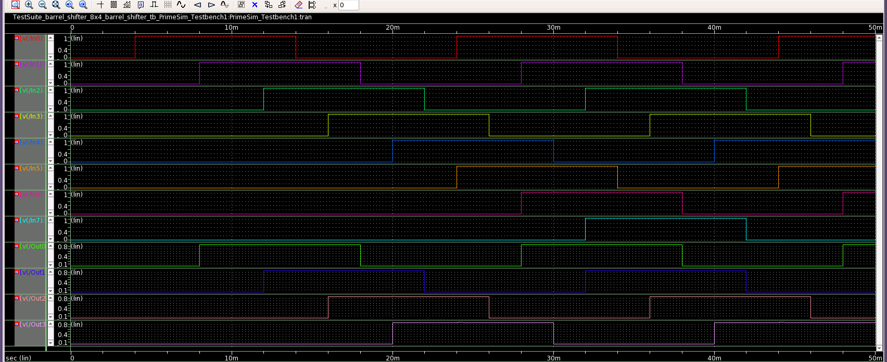
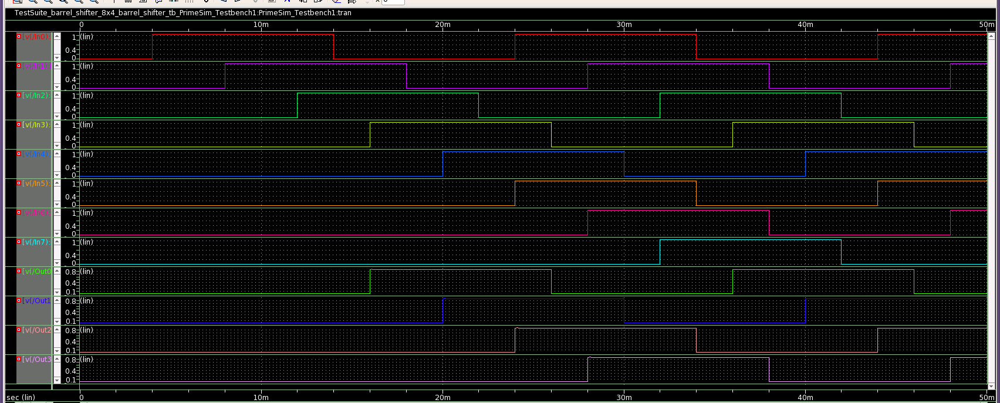
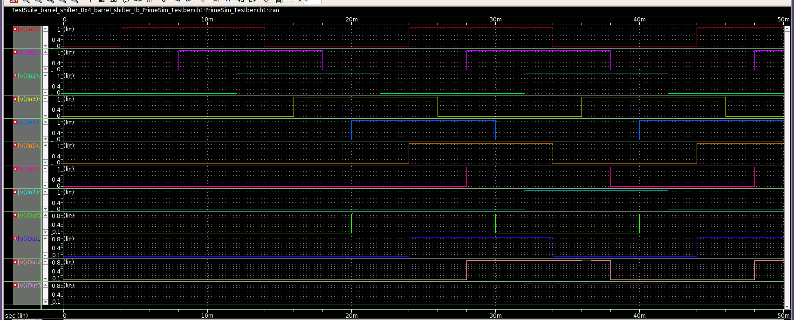

</br>

---



---

</br>


</br>

# 8x4 Right Barrel Shifter using NMOS Pass Transitor Logic


In this repository, It gives a detailed report on the design of a 8x4 Right Barrel Shifter using NMOS Pass Transistor logic using 28nm technology node. This design is implemented and simulated using **Synopsys Custom Design Compiler** for the event [_Cloud Based Analog IC Design Hackathon_](https://hackathoniith.in) conducted by the [Department of Electrical Engineering at IIT Hyderabad](https://ee.iith.ac.in), and sponsored by [Synopsys India](https://www.synopsys.com/company/contact-synopsys/office-locations/india/about-synopsys-india.html) and [VLSI System Design (VSD) Corp.](https://www.vlsisystemdesign.com) 

<p align="center">
  
</p>

<br>

# Table of Contents

* [Introduction](#Introduction) 
* [8x4 Right Barrel Shifter](#8x4-Right-Barrel-Shifter) 
    * [Circuit Schematic](#Circuit-Schematic) 
    * [Truth Table for Control Shift Bits in 8 × 4 Barrel Shifter](#Truth-Table-for-Control-Shift-Bits-in-8-×-4-Barrel-Shifter) 
    * [Circuit Output Waveforms](#Circuit-Output-Waveforms) 
* [Software Tools Used](#Software-Tools-Used) 
* [Synopsis Custom Compiler Platform](#Synopsis-Custom-Compiler-Platform) 
* [Implemented Circuit Design using Synopsis](#Implemented-Circuit-Design-using-Synopsis) 
    * [Schematics](#Schematics) 
    * [Symbol](#Symbol) 
    * [Testbench Design](#Testbench-Design) 
* [Resultant Waveforms](#Resultant-Waveforms) 
* [Resultant Waveforms For Different Control Shift Input](#Resultant-Waveforms-For-Different-Control-Shift-Input) 
* [Author](#Author)
* [Acknowledgements](#Acknowledgements)
* [References](#References)


<br>

# Introduction

An Arithmetic logic unit (ALU) in a processor can performs various arithmetic operations and logical operations. Multiplication operation is done by multiplying of data using AND gate and addition of partial products using full adders or half adders. It also requires a shifter to shift partial products so that they can be added in correct format and can be validated. Hence these modules play an important role in characterizing the performance of processors. 

 Thereare different types of shifters like serial shifter, parallel shifterswhich shifts data based on clock cycle of microprocessor.They require n cycle to shift n-data bits. To overcome thisdisadvantage, Barrel shifters are used. Barrel shifter is used to shift or rotate n-bits in single clock cycle based on the control shift bits configuration. It is usually consists of multiplexers connected parallel to each other. It works completely on combinational logic and shifts data in a single clock cycle. Due to its advantage, RISC processors use these barrel shifters embedded in ALU.

# 8x4 Right Barrel Shifter

## Circuit Schematic


## Truth Table for Control Shift Bits in 8 × 4 Barrel Shifter

<table>
 <tr><th colspan="5" style="text-align:center" > Control Shift Bits </th><th colspan="5"> Output </th></tr>
 <tr><td>Sh0</td><td>Sh1</td><td>Sh2</td><td>Sh3</td><td>Sh4</td><td>Out0</td><td>Out1</td><td>Out2</td><td>Out3</td></tr>
 <tr><td>1</td><td>0</td><td>0</td><td>0</td><td>0</td><td>In0</td><td>In1</td><td>In2</td><td>In3</td></tr>
 <tr><td>0</td><td>1</td><td>0</td><td>0</td><td>0</td><td>In1</td><td>In2</td><td>In3</td><td>In4</td></tr>
 <tr><td>0</td><td>0</td><td>1</td><td>0</td><td>0</td><td>In2</td><td>In3</td><td>In4</td><td>In5</td></tr>
 <tr><td>0</td><td>0</td><td>0</td><td>1</td><td>0</td><td>In3</td><td>In4</td><td>In5</td><td>In6</td></tr>
 <tr><td>0</td><td>0</td><td>0</td><td>0</td><td>1</td><td>In4</td><td>In5</td><td>In6</td><td>In7</td></tr>
</table>


## Circuit Output Waveforms


# Software Tools Used

🌟 OS: CentOS Linux 7.9.2009

 * The CentOS Linux distribution is a stable, predictable, manageable and reproducible platform derived from the sources of Red Hat Enterprise Linux (RHEL)

🌟 Synopsys Custom Compiler

 * The Synopsys Custom Compiler™ design environment is a modern solution for full-custom analog, custom digital, and mixed-signal IC design. As the heart of the Synopsys Custom Design Platform, Custom Compiler provides design entry, simulation management and analysis, and custom layout editing features. It delivers industry-leading productivity, performance, and ease-of-use while remaining easy to adopt for users of legacy tools.
    
   🔗 https://www.synopsys.com/implementation-and-signoff/custom-design-platform/custom-compiler.html

🌟 PrimeSim 

 *  PrimeSim™ SPICE is a high-performance SPICE circuit simulator for analog, RF, and mixed-signal applications. PrimeSim SPICE offers a unique multi-core/multi-machine scaling and heterogeneous compute acceleration on GPU/CPU delivering faster runtime with sign-off accuracy.

   🔗 https://www.synopsys.com/implementation-and-signoff/ams-simulation/primesim-spice.html

🌟 Synopsis SAED 32/28nm PDK

 * The Synopsys 28nm Process Design Kit(PDK)

# Synopsis Custom Compiler Platform








# Implemented Circuit Design using Synopsis

## Schematics


## Symbol


## Testbench Design


# Resultant Waveforms


## Resultant Waveforms For Different Control Shift Input 









# Netlist

The Netlist for the designed circuit is generated after simulating the circuit testbench. The Netlist is obtained using **PrimeSim**.

```
*  Generated for: PrimeSim
*  Design library name: barrel_shifter
*  Design cell name: 8x4_barrel_shifter_tb
*  Design view name: schematic
.lib 'saed32nm.lib' TT

*Custom Compiler Version S-2021.09
*Sat Feb 26 14:03:55 2022

.global gnd!
********************************************************************************
* Library          : barrel_shifter
* Cell             : 8x4_barrel_shifter
* View             : schematic
* View Search List : hspice hspiceD schematic spice veriloga
* View Stop List   : hspice hspiceD
********************************************************************************
.subckt _8x4_barrel_shifter in0 in1 in2 in3 in4 in5 in6 in7 out0 out1 out2 out3
+ sh0 sh1 sh2 sh3 sh4
xm30 out3 sh4 in7 gnd! n105 w=0.1u l=0.03u nf=1 m=1
xm29 out3 sh0 in3 gnd! n105 w=0.1u l=0.03u nf=1 m=1
xm28 out3 sh1 in4 gnd! n105 w=0.1u l=0.03u nf=1 m=1
xm27 out3 sh2 in5 gnd! n105 w=0.1u l=0.03u nf=1 m=1
xm26 out3 sh3 in6 gnd! n105 w=0.1u l=0.03u nf=1 m=1
xm25 out2 sh4 in6 gnd! n105 w=0.1u l=0.03u nf=1 m=1
xm24 out2 sh3 in5 gnd! n105 w=0.1u l=0.03u nf=1 m=1
xm22 out1 sh4 in5 gnd! n105 w=0.1u l=0.03u nf=1 m=1
xm15 out1 sh1 in2 gnd! n105 w=0.1u l=0.03u nf=1 m=1
xm13 out0 sh4 in4 gnd! n105 w=0.1u l=0.03u nf=1 m=1
xm20 out2 sh1 in3 gnd! n105 w=0.1u l=0.03u nf=1 m=1
xm19 out2 sh0 in2 gnd! n105 w=0.1u l=0.03u nf=1 m=1
xm18 out1 sh3 in4 gnd! n105 w=0.1u l=0.03u nf=1 m=1
xm17 out1 sh2 in3 gnd! n105 w=0.1u l=0.03u nf=1 m=1
xm16 out1 sh0 in1 gnd! n105 w=0.1u l=0.03u nf=1 m=1
xm21 out2 sh2 in4 gnd! n105 w=0.1u l=0.03u nf=1 m=1
xm3 out0 sh2 in2 gnd! n105 w=0.1u l=0.03u nf=1 m=1
xm2 out0 sh1 in1 gnd! n105 w=0.1u l=0.03u nf=1 m=1
xm1 out0 sh0 in0 gnd! n105 w=0.1u l=0.03u nf=1 m=1
xm4 out0 sh3 in3 gnd! n105 w=0.1u l=0.03u nf=1 m=1
.ends _8x4_barrel_shifter

********************************************************************************
* Library          : barrel_shifter
* Cell             : 8x4_barrel_shifter_tb
* View             : schematic
* View Search List : hspice hspiceD schematic spice veriloga
* View Stop List   : hspice hspiceD
********************************************************************************
xi0 in0 in1 in2 in3 in4 in5 in6 in7 out0 out1 out2 out3 sh0 sh1 sh2 sh3 sh4
+ _8x4_barrel_shifter
v8 in0 gnd! dc=0 pulse ( 0 1.05 4m 200p 200p 10m 20m )
v7 in1 gnd! dc=0 pulse ( 0 1.05 8m 200p 200p 10m 20m )
v6 in2 gnd! dc=0 pulse ( 0 1.05 12m 200p 200p 10m 20m )
v5 in3 gnd! dc=0 pulse ( 0 1.05 16m 200p 200p 10m 20m )
v4 in4 gnd! dc=0 pulse ( 0 1.05 20m 200p 200p 10m 20m )
v3 in5 gnd! dc=0 pulse ( 0 1.05 24m 200p 200p 10m 20m )
v2 in6 gnd! dc=0 pulse ( 0 1.05 28m 200p 200p 10m 20m )
v1 in7 gnd! dc=0 pulse ( 0 1.05 32m 200p 200p 10m 20m )
c30 out2 gnd! c=1p
c29 out3 gnd! c=1p
c28 out1 gnd! c=1p
c27 out0 gnd! c=1p
v35 sh0 gnd! dc=0
v36 sh1 gnd! dc=0
v37 sh3 gnd! dc=0
v39 sh2 gnd! dc=0
v38 sh4 gnd! dc=1.05


.tran '0.001*(50m-0)' '50m' name=tran

.option primesim_remove_probe_prefix = 0
.probe v(*) i(*) level=1
.probe tran v(in0) v(in1) v(in2) v(in3) v(in4) v(in5) v(in6) v(in7) v(out0)
+ v(out1) v(out2) v(out3)

.temp 25


.option primesim_output=wdf


.option parhier = LOCAL


.end

```


# Author
 
 🖊️ Nalinkumar S, Pre-Final year student, B.E. ECE, Madras Institute of Technology, Anna University, Chennai, India
 
 
# Acknowledgements

 📖 Kunal Ghosh, Co-Founder of VLSI System Design (VSD) Corp. Pvt. Ltd. - kunalpghosh@gmail.com
 
 📖 [Synopsys Team/Company](https://www.synopsys.com/)
 
 📖 Chinmay panda, Technical Officer, Department of Electrical Engineering, IIT Hyderabad

# References

📔 P. Ashok Babu, V. Siva Nagaraju, Ramya Mariserla, Rajeev Ratna
Vallabhuni, ”Realization of 8 x 4 Barrel shifter with 4-bit binary to Gray
converter using FinFET for Low Power Digital Applications,” in Journal
of Physics: Conference Series, 2021.

📔 Bari, Surajit De, Debashis Sarkar, Angsuman , ”Design of low power,
high speed 4 bit binary to Gray converter with 8 × 4 barrel shifter using
nano dimensional MOS transistor for arithmetical, logical and telecommunication circuit and system application,” Microsystem Technologies,
2019.

📔 J. S. Deepak Vudatha, N. Kota, P. Gutha, B. Sreeja and S. P. Rajeev,
”VLSI Design of Low Power 8 × 4 Barrel Shifter using 90 nm TG
technology,” 2021 Fourth International Conference on Microelectronics,
Signals Systems (ICMSS), 2021.

