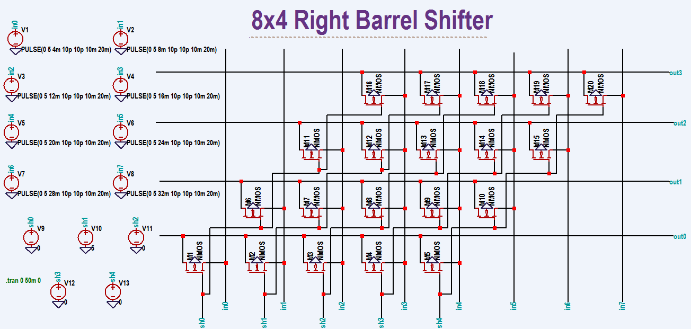
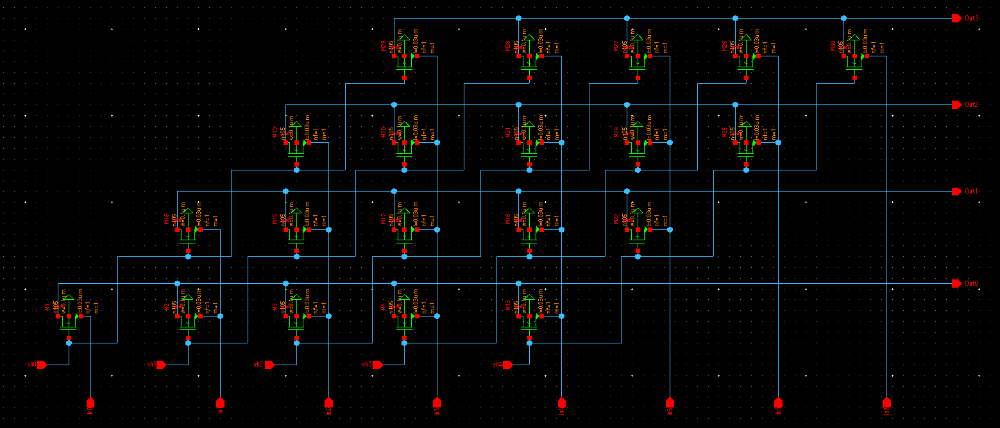
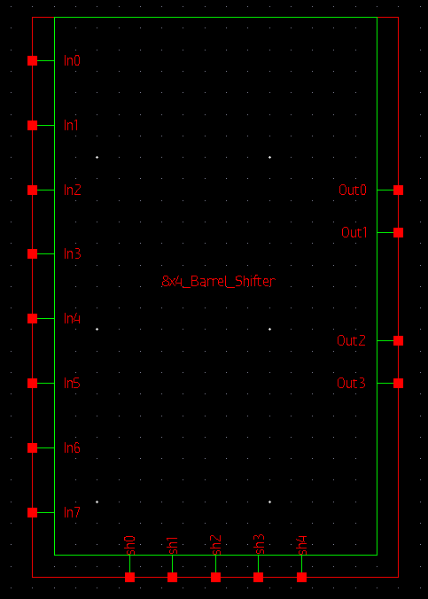
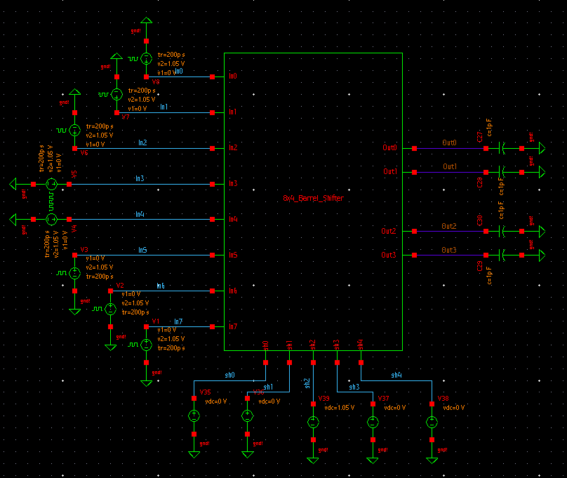
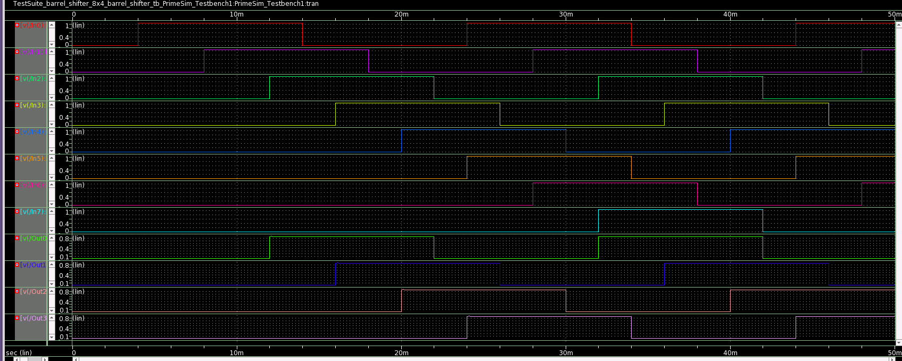

# 8x4 Right Barrel Shifter using NMOS Pass Transitor Logic

In this repository, It gives a detailed report on the design of a 8x4 Right Barrel Shifter using NMOS Pass Transistor logic using 28nm technology node. This design is implemented and simulated using **Synopsys Custom Design Compiler** for the event [_Cloud Based Analog IC Design Hackathon_](https://hackathoniith.in) conducted by the [Department of Electrical Engineering at IIT Hyderabad](https://ee.iith.ac.in), and sponsored by [Synopsys India](https://www.synopsys.com/company/contact-synopsys/office-locations/india/about-synopsys-india.html) and [VLSI System Design (VSD) Corp.](https://www.vlsisystemdesign.com) 

# Introduction

An Arithmetic logic unit (ALU) in a processor performs various arithmetic operations like addition, subtraction, multiplication and also performs logical operations like AND, OR etc. Most of the operations require only operands, but few operations require sub-modules along with operands. For example, multiplication operation is done by multiplying of data using AND gate and addition of partial products using full adders or half adders. It also requires a shifter to shift partial products so that they can be added in correct format. Hence these modules play an important role in characterizing the performance of processors. 

Different types of shifters available in digital electronics. They are basically sequential shifter such as serial shifters, parallel shifters which shifts or rotates data based on clock cycle of the processor. They require n clock cycles to shift n-data bits which are not beneficial in terms of performance of the processor. To overcome this problem, ALU‘s are embedded with a module called Barrel shifter. A Barrel shifter as name suggests shits data either left or right based on the control shift bits configuration. It is usually consists of multiplexers connected parallel to each other. It works completely on combinational logic and shifts data in a single clock cycle. Due to its advantage, RISC processors use these barrel shifters embedded in ALU.

# 8x4 Right Barrel Shifter

## Circuit Schematic

## Circuit Output Waveforms

# Tools used

🌟 OS: CentOS Linux 7.9.2009

 * The CentOS Linux distribution is a stable, predictable, manageable and reproducible platform derived from the sources of Red Hat Enterprise Linux (RHEL)

🌟 Synopsys Custom Compiler

 * The Synopsys Custom Compiler™ design environment is a modern solution for full-custom analog, custom digital, and mixed-signal IC design. As the heart of the Synopsys Custom Design Platform, Custom Compiler provides design entry, simulation management and analysis, and custom layout editing features. It delivers industry-leading productivity, performance, and ease-of-use while remaining easy to adopt for users of legacy tools.
    
   🔗 https://www.synopsys.com/implementation-and-signoff/custom-design-platform/custom-compiler.html

🌟 PrimeSim 

 *  PrimeSim™ SPICE is a high-performance SPICE circuit simulator for analog, RF, and mixed-signal applications. PrimeSim SPICE offers a unique multi-core/multi-machine scaling and heterogeneous compute acceleration on GPU/CPU delivering faster runtime with sign-off accuracy.

   🔗 https://www.synopsys.com/implementation-and-signoff/ams-simulation/primesim-spice.html

🌟 Synopsis SAED 32/28nm PDK

 * The Synopsys 28nm Process Design Kit(PDK)

# Implemented Circuit Design

## Schematics

## Symbol

## Testbench Design

# Resultant waveform

# Author
 
 🖊️ Nalinkumar S , B.E (Electronics and Communication Engineering), Madras Institute of Technology, Anna University, Tamil Nadu 
 
 
# Acknowledgements

 📖 Kunal Ghosh, Co-Founder of VLSI System Design (VSD) Corp. Pvt. Ltd. - kunalpghosh@gmail.com
 
 📖 [Synopsys Team/Company](https://www.synopsys.com/)
 
 📖 Chinmay panda, IIT Hyderabad

# Reference

📔 [1] P. Ashok Babu, V. Siva Nagaraju, Ramya Mariserla, Rajeev Ratna
Vallabhuni, ”Realization of 8 x 4 Barrel shifter with 4-bit binary to Gray
converter using FinFET for Low Power Digital Applications,” in Journal
of Physics: Conference Series, 2021.

📔 [2] Bari, Surajit De, Debashis Sarkar, Angsuman , ”Design of low power,
high speed 4 bit binary to Gray converter with 8 × 4 barrel shifter using
nano dimensional MOS transistor for arithmetical, logical and telecommunication circuit and system application,” Microsystem Technologies,
2019.

📔 [3] J. S. Deepak Vudatha, N. Kota, P. Gutha, B. Sreeja and S. P. Rajeev,
”VLSI Design of Low Power 8 × 4 Barrel Shifter using 90 nm TG
technology,” 2021 Fourth International Conference on Microelectronics,
Signals Systems (ICMSS), 2021.

